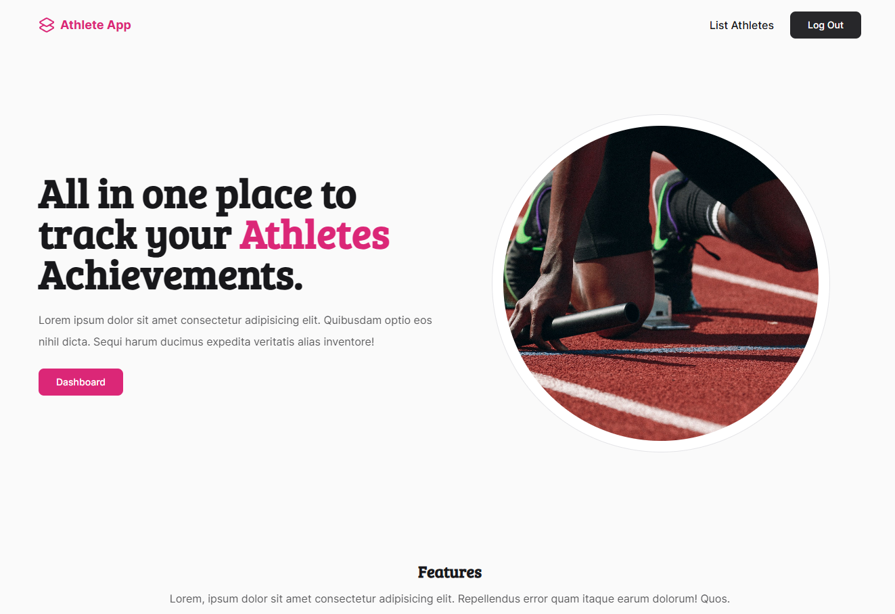

## Project Description

All in one place to track your Athletes Achievements, a simple and easy to use laravel web application,
using laravel, tailwindcss, and alpinejs with sqlite database.

## Screenshots



## Features

- CRUD for Athletes
- CRUD for Achievements
- Pagination
- Form Validation
- File Upload
- Authentication
- MVC Architecture

## Requirements

- PHP 8.2
- Laravel 11.0
- Node LTS

## Installation

1. Clone the repository

```bash
git clone https://github.com/nichiyoo/athelete-app.git
```

2. Go to the project directory, and install the dependencies

```bash
cd athelete-app

composer install
npm install
```

3. Copy the .env.example file to .env and fill in the required details, example:

```bash
APP_NAME="Athlete App"

...

DB_CONNECTION=sqlite
```

4. Create a storage folder `./storage/app/media`, then link it to the public folder.

First make sure you have the public folder created, like so:

```bash
root/
    app/
    bootstrap/
    ...
    storage/
        app/
            media/
            public/
    .env
    ...
```

Then run the following command:

```bash
php artisan storage:link
```

5. Generate the key and store it in the .env file

```bash
php artisan key:generate
```

6. Run the migration

```bash
php artisan migrate
```

The first migration with sqlite will prompt you to create a database file, you can choose the name and location of the database,
or just press enter to use the default location.

7. Run the seeder

```bash
php artisan db:seed
```

8. Compile the assets

```bash
npm run build
```

9. Run the application

```bash
php artisan serve
```

10. Open your browser and navigate to http://localhost:8000
